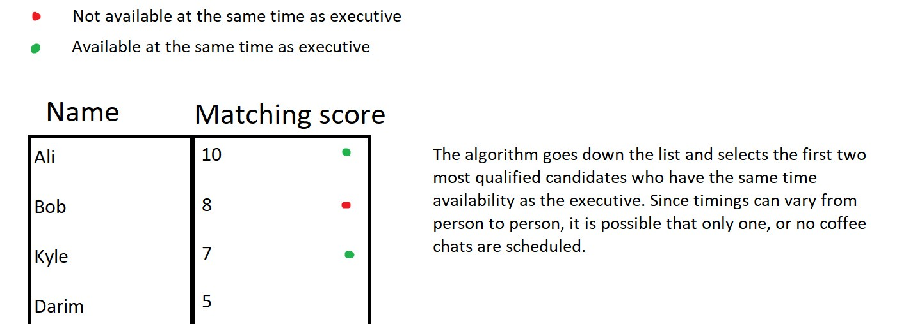

# Coffee Chats Matching Algorithm and Test Case Generator

## Overview
This project implements an algorithm in Python to facilitate weekly coffee chats for Aspiring Professionals and Senior Executives on a platform. The algorithm considers various factors such as industry alignment, the interests of Aspiring Professionals, and the availability of Senior Executives.

## How to Test the Solution

Before testing the solution, ensure Python 3.9 or newer is installed.

Once in the hashmi_mairah folder, you can create a virtual environment and activate it, by running:

```
python -m venv venv
# Windows
.\venv\Scripts\activate
# macOS/Linux
source venv/bin/activate
```

1. **Run `python gencases.py` to run file to generate a new test case.** 
   - The generated data will be saved in the `testcase.txt` file.

2. **Run `python strictalgo.py` to generate a list of coffee chats with the given data.**

3. **Run `python -m unittest discover tests` to run unit tests**

## How the Algorithm Works
The basis of the matching algorithm is the calculated "matching score". The matching score is created based on various properties that are common between an aspiring professional and executive.

### Matching Scores
Matching scores are calculated for every aspiring professional against an executive. A list is then compiled ranking the aspiring professionals by matching score from greatest to least. Every executive has their own sorted list of aspiring professionals in order of matching score.

Once all the lists are compiled, each executive goes down the list from highest matching score to lowest and schedules the highest matching scores on the list with the same availability as the executive.

If an aspiring professional selected on the list fails to have the same availability as the executive, the next highest matching score on the list is selected. Availability is listed as days Monday - Friday described in military time in the code.

The image below is a visual representation of the selection algorithm after matching scores are calculated:




### Architecture
#### Classes
The solution is structured as follows:

AspiringProfessional Class: Represents an Aspiring Professional with attributes such as id, name, industry, interests, and activity.
SeniorExecutive Class: Represents a Senior Executive with attributes such as frequency, id, name, industry, and interests.
CoffeeChat Class: Represents a Coffee Chat session with attributes such as aspiring_professional_id, senior_executive_id, and date.
CoffeeChatScheduler Class: Contains the algorithm to match Aspiring Professionals with Senior Executives based on their industry and interests, ensuring fair distribution of coffee chats.

### Solution Architecture
The solution function is designed to take five variables:

Aspiring professionals per industry
Senior executives per industry
Interests per aspiring professional
Weeks to simulate
Industries

These variables are important in determining the longevity and efficiency of the algorithm.

### Benefits
Weekly Scheduling: Ensures a coffee chat for every Aspiring Professional on the platform each week.
Fair Distribution: Balances the frequency of Senior Executives' appearances to avoid overburdening any single executive.

### Trade-offs
Simplicity vs. Complexity: The current implementation favors simplicity and clarity over handling very large datasets or complex scenarios.
Frequency Balance: Uses a simple frequency counter to balance executive appearances; more complex algorithms could better handle edge cases but were deemed unnecessary for the scope of this project.

### Improvements
Scalability: Increase the number of Senior Executives and Aspiring Professionals to handle a higher user base.
Realistic Ratios: Adjust the ratio of Aspiring Professionals to Senior Executives to avoid spreading executives too thin.
Additional Attributes: Incorporate more attributes such as location, hobbies, education, etc., for better matching.
Algorithm Enhancement: Use artificial intelligence to recommend coffee chats based on interests and previous interactions.